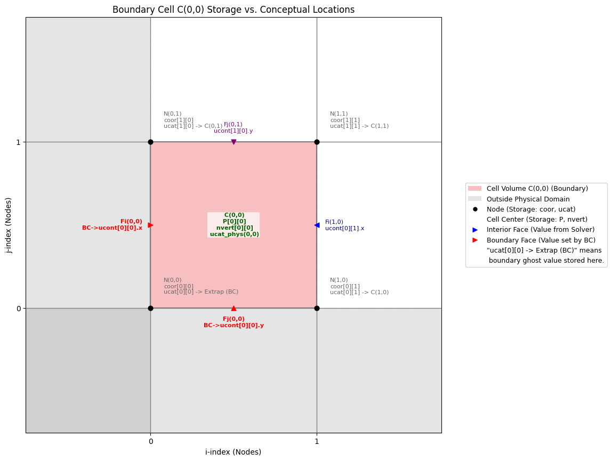
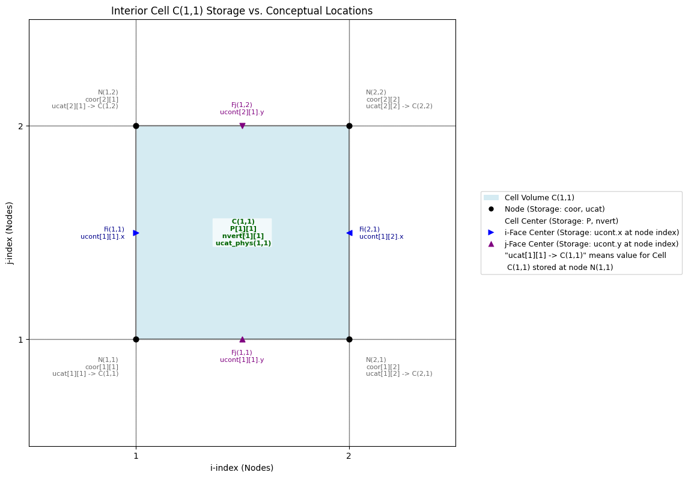

Of course! Here is the provided information formatted as a clean and professional Markdown `README.md` file.

---

# 🌀 PICurv: A Parallel Particle-in-Cell Solver for Curvilinear LES

> **PICurv** is a parallel particle-in-cell (PIC) solver designed for low-Mach-number turbulent flows in complex geometries. Built using PETSc’s `DMDA` and `DMSwarm` infrastructure, it features:
> * A **fractional-step incompressible Navier–Stokes solver** with **dynamic Smagorinsky LES**
> * Support for **body-fitted curvilinear grids** and **immersed boundaries (CURVIB)**
> * Fully **MPI-parallel particle tracking** with two-way Eulerian–Lagrangian coupling
> * Trilinear interpolation (grid → particle) and conservative face-based projection (particle → grid)
>
> The solver has been validated on canonical geometries such as curved pipes and demonstrates scalable performance for **millions of particles** on both structured Cartesian and curvilinear meshes.

---

## 🔧 Key Features

*   **Parallelized 3D particle-in-cell solver** with PETSc
*   **Low-Mach number incompressible Navier–Stokes** with LES modeling
*   **Two-way coupled Lagrangian particle transport**
*   **Trilinear interpolation and deposition kernels**
*   **Geometric flexibility** via immersed boundary methods (CURVIB)
*   **Modular architecture** with plug-and-play routines for scalar transport, stochastic mixing, and particle diagnostics

---

## 🚀 Getting Started

### Dependencies

*   PETSc 3.20.3 or newer (built with MPI and `DMSWARM` support)

### Building the Project

To build the solver and postprocessor:

```bash
make inttest       # Builds main solver executable `inttest`
make postprocess   # Builds postprocessor executable `postprocess`
```

Ensure PETSc paths are configured correctly in your Makefile or environment.

### Directory Structure

```text
.
├── src/           # Source files (*.c)
├── include/       # Header files (*.h)
├── scripts/       # Python utilities
├── params/        # Input files for a run (grid, config, BCs)
├── run/           # Example run directory (created manually)
│   ├── control.dat
│   ├── params/
│   │   ├── config.dat
│   │   ├── bcs.dat
│   │   └── grid.dat (optional if using generated grid)
│   ├── inttest -> ../inttest (symlink)
│   └── postprocess -> ../postprocess (symlink)
```

---

## ▶️ Running the Code

1.  **Create a new `run/` directory**.
2.  **Place a `control.dat`** file inside. See below for a sample.
3.  **Create symbolic links** to the built executables:
    ```bash
    ln -s ../inttest inttest
    ln -s ../postprocess postprocess
    ```
4.  Ensure a `params/` subdirectory exists within `run/` with:
    *   `config.dat`
    *   `bcs.dat`
    *   (optional) `grid.dat` if using curvilinear meshes
5.  Run the solver:
    ```bash
    mpirun -np 4 ./inttest -f control.dat
    ```

---

## 📄 Sample `control.dat` Configuration

```plaintext
###########################################################################################################################
### I/O & Management  ###
-tio 1
-logfreq 10
-func_config_file "params/config.dat"
-grid_file "params/grid_bent_tube.dat"
-bcs_file "params/bcs.dat"
-Setup_Only 0

### PARTICLES
-numParticles 100
-pinit 0

### SIMULATION
-dt 0.1
-totalsteps 10
-rstart 0
-ti 0.0
-finit 2
-ucont_x 0.0
-ucont_y 0.0
-ucont_z 1.0

### GRID
-grid 0
-xMin 0.00
-xMax 1.00
-yMin 0.00
-yMax 1.00
-zMin 0.00
-zMax 1.00
-nblk 1
-im 20
-jm 20
-km 280
-r_x 1.0
-r_y 1.0
-r_z 1.0

### PARALLELIZATION
-dm_processors_x 2
-dm_processors_y 2
#-dm_processors_z 2
###########################################################################################################################
```

---

## 🗖️ Grid File Format (`grid.dat`)

To use a pre-generated body-fitted or curvilinear mesh, create a file `grid.dat` in the `params/` directory with the following structure:

```text
FDFGRID                # format tag
1                      # number of blocks
20 20 280              # number of cells in i, j, k for the block
x0 y0 z0               # node 0 coordinates
x1 y1 z1
x2 y2 z2
...
```

The coordinates specify node positions along the primary directions, and the grid is assumed to be structured and logically rectangular.

---

## 📂 Function-Level Logging (Sample `config.dat`)

Use `params/config.dat` to selectively enable logging of specific functions when running with `export LOG_LEVEL=DEBUG`.

Example:

```text
# ============================================================================
#               Function Logging Allow-List for Phase 1
# ============================================================================
main
AdvanceSimulation_TEST
PerformInitialSetup_TEST

# Boundary condition routines (uncomment to debug):
#Create_InletConstantVelocity
#Apply_InletConstantVelocity
#Initialize_InletConstantVelocity
```

This allows clean and controlled tracing of solver behavior for debugging or testing.

---

## 🧭 Grid Indexing and Layout (Arakawa C-grid)

PICurv follows a node-centered Arakawa C-grid indexing strategy with ghost cells and directional velocity storage. The figures below illustrate this storage scheme:

### Boundary Cell C(0,0) Layout



### Interior Cell C(1,1) Layout



### Schematic: Physical and Ghost Cells


## Physical Locations of Key Vector and Scalar Quantities

Excellent. This is a very detailed and well-structured breakdown of the solver's data layout. Here is that information formatted into a clean and comprehensive Markdown section, ready to be added to your `README.md`.

---

## 💾 Data Layout and Grid Indexing

This section details the physical locations and indexing conventions for key scalar and vector quantities on the staggered Arakawa C-grid used by PICurv.

### Physical Locations of Key Quantities

The following table outlines where different fields are stored relative to a computational cell `(ic,jc,kc)`.

| Variable Name (Array Access Example) | Data Type | Physical Quantity | Primary Physical Location | Associated DMDA | Notes |
| :--- | :--- | :--- | :--- | :--- | :--- |
| **Cell-Centered Quantities** | | | **Geometric Center of Cell `(ic,jc,kc)`** | | Stored with array indices `[kc][jc][ic]` |
| `P[kc][jc][ic]` | `PetscScalar` | Pressure | Center of Cell `(ic,jc,kc)` | `da` | |
| `ucat[kc][jc][ic]` | `Cmpnts` | Cartesian Velocity (u,v,w) | Center of Cell `(ic,jc,kc)` | `fda` | Derived from face-based `ucont`. |
| `Aj[kc][jc][ic]` | `PetscScalar` | Jacobian Inverse (1/J) | Center of Cell `(ic,jc,kc)` | `da` | Primary Jacobian calculation. |
| `nvert[kc][jc][ic]` | `PetscScalar` | Cell Status / Blanking Flag | Center of Cell `(ic,jc,kc)` | `da` | Used for IBM, overset grids. |
| `K_Omega[kc][jc][ic]` | `Cmpnts` | Turbulence k & ω | Center of Cell `(ic,jc,kc)` | `fda2` | For RANS models. |
| `Cent[kc][jc][ic]` | `Cmpnts` | Physical Coords (x,y,z) of Cell Center | Center of Cell `(ic,jc,kc)` | `fda` | Calculated by averaging node coordinates. |
| `GridSpace[kc][jc][ic]` | `Cmpnts` | Characteristic Grid Spacings (dx,dy,dz-like) | Center of Cell `(ic,jc,kc)` | `fda` | Distances between face centers. |
| **Node-Based Quantities** | | | **Geometric Grid Node** | | |
| `coor[kn][jn][in]` | `Cmpnts` | Physical Coords (x,y,z) of Node | Grid Node `(in,jn,kn)` | `fda` | `coor[kc][jc][ic]` is the Bottom-Left-Front node of cell `(ic,jc,kc)`. |
| **Face-Based Quantities (Staggered)** | | | **On the Surface of a Cell Face** | | |
| `ucont[k][j][i].x` | `PetscScalar` | U-Contravariant Velocity (ξ-comp) | On I-Face `i` | `fda` | Normal velocity component to I-Face. `csi` is collocated. |
| `csi[k][j][i]` | `Cmpnts` | Metric Vector ∇ξ (ξ_x, ξ_y, ξ_z) | On I-Face `i` | `fda` (`lCsi`) | Related to area vector of I-Face. |
| `ucont[k][j][i].y` | `PetscScalar` | V-Contravariant Velocity (η-comp) | On J-Face `j` | `fda` | Normal velocity component to J-Face. `eta` is collocated. |
| `eta[k][j][i]` | `Cmpnts` | Metric Vector ∇η (η_x, η_y, η_z) | On J-Face `j` | `fda` (`lEta`) | Related to area vector of J-Face. |
| `ucont[k][j][i].z` | `PetscScalar` | W-Contravariant Velocity (ζ-comp) | On K-Face `k` | `fda` | Normal velocity component to K-Face. `zet` is collocated. |
| `zet[k][j][i]` | `Cmpnts` | Metric Vector ∇ζ (ζ_x, ζ_y, ζ_z) | On K-Face `k` | `fda` (`lZet`) | Related to area vector of K-Face. |
| **Face-Center Quantities (Interpolated)** | | | **Geometric Center of a Cell Face** | | |
| `Centx[k][j][i]` | `Cmpnts` | Physical Coords (x,y,z) of I-Face Center | Geometric Center of I-Face `i` | `fda` | |
| `IAj[k][j][i]` | `PetscScalar` | Jacobian Inverse (1/J) at I-Face Center | Geometric Center of I-Face `i` | `da` | |
| `Centy[k][j][i]` | `Cmpnts` | Physical Coords (x,y,z) of J-Face Center | Geometric Center of J-Face `j` | `fda` | |
| `JAj[k][j][i]` | `PetscScalar` | Jacobian Inverse (1/J) at J-Face Center | Geometric Center of J-Face `j` | `da` | |
| `Centz[k][j][i]` | `Cmpnts` | Physical Coords (x,y,z) of K-Face Center | Geometric Center of K-Face `k` | `fda` | |
| `KAj[k][j][i]` | `PetscScalar` | Jacobian Inverse (1/J) at K-Face Center | Geometric Center of K-Face `k` | `da` | |

**Notes on Face-Based Indexing Relative to Cell `(ic,jc,kc)`:**

*   **Left I-Face** (face `ic`):
    *   U-velocity: `ucont[kc][jc][ic].x`
    *   Metrics: `csi[kc][jc][ic]`
*   **Right I-Face** (face `ic+1`):
    *   U-velocity: `ucont[kc][jc][ic+1].x`
    *   Metrics: `csi[kc][jc][ic+1]`
*   **Bottom J-Face** (face `jc`):
    *   V-velocity: `ucont[kc][jc][ic].y`
    *   Metrics: `eta[kc][jc][ic]`
*   **Top J-Face** (face `jc+1`):
    *   V-velocity: `ucont[kc][jc+1][ic].y`
    *   Metrics: `eta[kc][jc+1][ic]`
*   **Front K-Face** (face `kc`):
    *   W-velocity: `ucont[kc][jc][ic].z`
    *   Metrics: `zet[kc][jc][ic]`
*   **Back K-Face** (face `kc+1`):
    *   W-velocity: `ucont[kc+1][jc][ic].z`
    *   Metrics: `zet[kc+1][jc][ic]`

### Grid Structure and Indexing Conventions

**Assumptions:**

*   `IM`, `JM`, `KM`: Number of *allocated cells* in the i, j, k directions, respectively.
*   `ucat[k][j][i]`: Cell-centered value for the cell whose origin node (lower-left-back corner) is `(i,j,k)`.
*   `coor[k][j][i]`: Physical coordinate `(x,y,z)` of the grid **node** `(i,j,k)`.
*   `ucont[k][j][i].x`: Contravariant U-velocity on the **constant-i face** passing through node `(i,j,k)`. This face separates cell `(i-1,j,k)` from cell `(i,j,k)`.
*   `ucont[k][j][i].y`: Contravariant V-velocity on the **constant-j face** passing through node `(i,j,k)`. This face separates cell `(i,j-1,k)` from cell `(i,j,k)`.
*   `ucont[k][j][i].z`: Contravariant W-velocity on the **constant-k face** passing through node `(i,j,k)`. This face separates cell `(i,j,k-1)` from cell `(i,j,k)`.

**Grid Layout Table:**

| Feature | Description | Cell Indices (for `ucat`) | Node Indices (for `coor`) | Face Indices: `Ucont.x` (i-faces) | Face Indices: `Ucont.y` (j-faces) | Face Indices: `Ucont.z` (k-faces) |
| :--- | :--- | :--- | :--- | :--- | :--- | :--- |
| **Allocated Grid** | Entire grid in memory | `i=0..IM-1`<br>`j=0..JM-1`<br>`k=0..KM-1` | `i=0..IM`<br>`j=0..JM`<br>`k=0..KM` | `i=0..IM` | `j=0..JM` | `k=0..KM` |
| **Physical Domain** | Region for solving physics | `i=1..IM-2`<br>`j=1..JM-2`<br>`k=1..KM-2` | Nodes `(1,1,1)` to<br>`(IM-1,JM-1,KM-1)` | `i=1..IM-1` | `j=1..JM-1` | `k=1..KM-1` |
| **Ghost Layer** | Cells for boundary data | `i=0` or `IM-1`<br>`j=0` or `JM-1`<br>`k=0` or `KM-1` | Nodes `i=0,IM`<br>`j=0,JM`<br>`k=0,KM` | Faces `i=0, IM` | Faces `j=0, JM` | Faces `k=0, KM` |

**Key Takeaways:**

1.  **Index Shift:** The **physical** cell indices are shifted inwards by one from the allocated memory range (e.g., `1..IM-2` vs `0..IM-1`). The outermost layer represents ghost cells.
2.  **Storage Consistency:** A cell-centered value for cell `(i,j,k)` (physical or ghost) is always stored at `ucat[k][j][i]`. A node coordinate for node `(i,j,k)` is always at `coor[k][j][i]`.
3.  **Coordinate Mapping:** The node `(0,0,0)` (corner of the first ghost cell `(0,0,0)`) usually corresponds to the physical origin `(0,0,0)`.
4.  **Boundary Conditions:** BC functions operate on the **ghost layer**, setting values (e.g., `ucont`) on the domain-bounding faces (e.g., `i=0`, `i=IM`) using information from the adjacent physical cells.
5.  **Parallelism (DMDA):** PETSc's `DMGlobalToLocalBegin/End` automatically populates the ghost cells with data from neighboring MPI processes. The explicit BC functions handle the true physical boundaries of the global domain.

## 📜 Citation / Acknowledgements

This work is supported by the **National Science Foundation (NSF Award No. 2309630)** and computational resources from the **High-Performance Research Computing (HPRC) center at Texas A\&M University**.

---

Let me know if you’d like to add performance benchmarks, case studies, or a “Contributing” section next.
